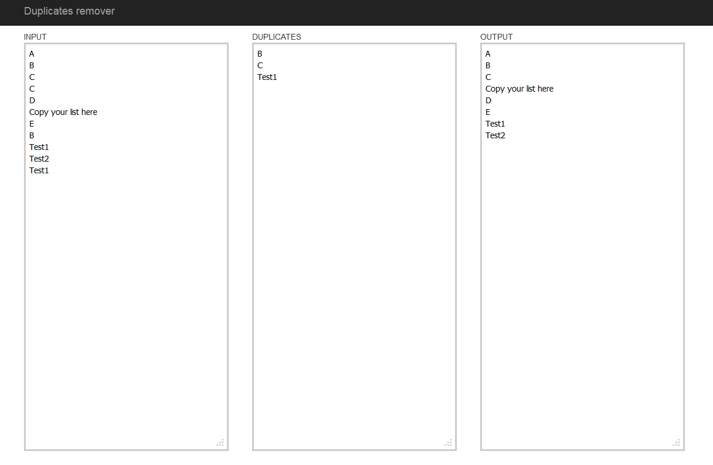

duplicates-killer
=================

Small Javascrip application that detects and removes duplicates from a list of inputs.
Useful when you work with lists of data and want to detect or remove duplicates.
Usually it's painfull to do this in Excel or Notepad++ so I created this tool to save time.

Left column is where to copy-paste the list.
Middle column is the duplicates that were detected.
Right column is a duplicates-free list.
